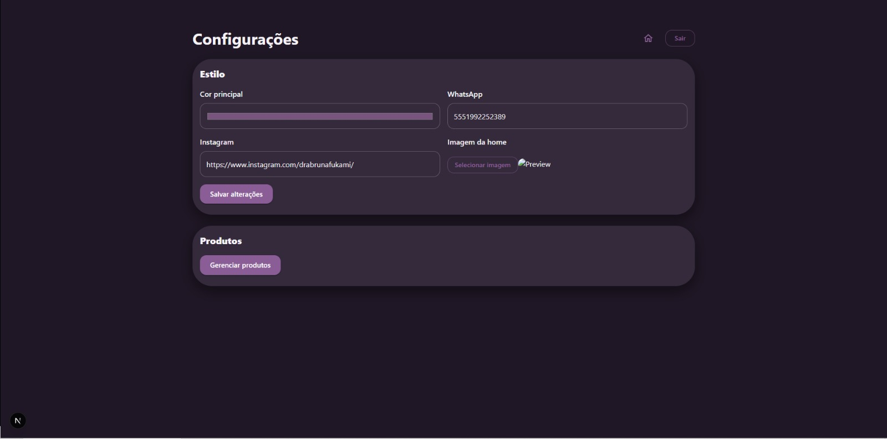
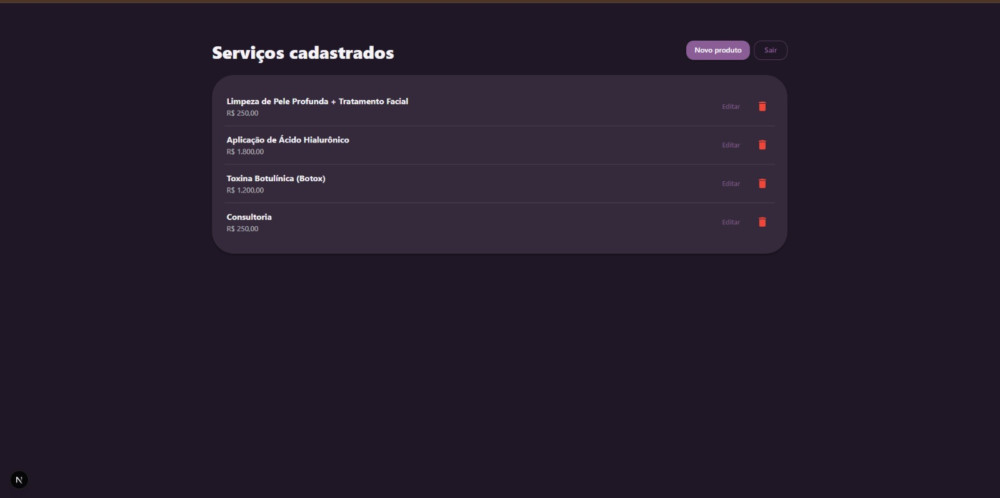
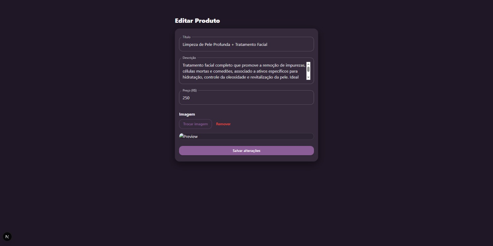

# 🛍️ ecommerce-nestjs

Aplicação **fullstack** desenvolvida em **NestJS + Next.js** para venda de **serviços sem carrinho**, com foco em **conversão via WhatsApp** e **customização visual dinâmica**.

Projeto criado como **portfolio técnico** e **caso real de uso**.

---

## 📸 Screenshots

### Home (área pública)


### Listagem de serviços


### Detalhes do serviço


### Painel administrativo – Configurações



### Painel administrativo – Produtos



### Edição de produto



---

## 🧱 Arquitetura

**Monorepo**
ecommerce-nestjs/
├── apps/
│ ├── api/ → NestJS + Prisma + PostgreSQL
│ └── web/ → Next.js (App Router) + MUI

## 🔧 Stack

### Backend

- NestJS
- Prisma ORM
- PostgreSQL
- API REST
- Upload de imagens
- Configurações persistidas em banco

### Frontend

- Next.js (App Router)
- React
- MUI (Material UI)
- Tema dinâmico controlado pela API

---

## ⚙️ Funcionalidades

### Área pública

- Landing page customizável (cor + imagem)
- Listagem e detalhes de serviços
- Preço formatado (R$)
- CTA para WhatsApp com mensagem dinâmica
- Link para Instagram

### Área administrativa

- Login de administrador
- CRUD de produtos/serviços
- Upload e gerenciamento de imagens
- Configurações globais:
  - cor principal
  - WhatsApp
  - Instagram
  - imagem da home

---

## 💬 Integração com WhatsApp

- Mensagem gerada dinamicamente
- Nome do serviço + valor formatado
- Texto complementar
- Uso de `encodeURIComponent` para garantir URL segura

---

## ▶️ Rodar localmente

### Pré-requisitos

- Node.js (LTS)
- PostgreSQL

### Backend

```bash
cd apps/api
npm install
npx prisma migrate dev
npm run start:dev

Frontend
cd apps/web
npm install
npm run dev


Web: http://localhost:3001

API: http://localhost:3000

🌍 Deploy

Deploy planejado para Render (API e Web).
Links de produção serão adicionados após publicação.

👩‍💻 Autora

Ândria Aquino Ferreira
Fullstack Developer

Node.js · TypeScript · NestJS · Prisma · PostgreSQL · React · Next.js
```
